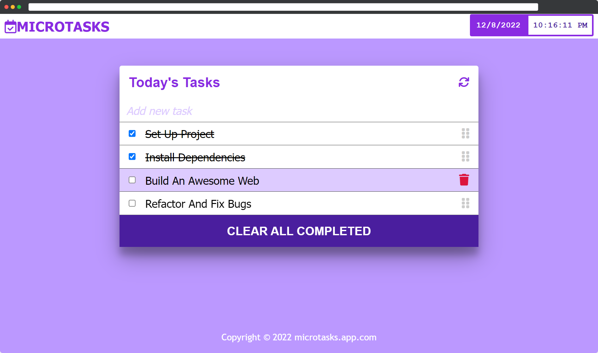

<a name="readme-top"></a>

<div align="center">

  
  <br/>

  <h3><b>Microverse Project</b></h3>

</div>

<!-- TABLE OF CONTENTS -->

# 📗 Table of Contents

- [📗 Table of Contents](#-table-of-contents)
- [📅 Microtasks ](#-microtasks-)
  - [🛠 Built With ](#-built-with-)
    - [Tech Stack ](#tech-stack-)
    - [Key Features ](#key-features-)
  - [🚀 Live Demo ](#-live-demo-)
  - [💻 Getting Started ](#-getting-started-)
    - [Prerequisites](#prerequisites)
    - [Setup](#setup)
    - [Install](#install)
    - [Usage](#usage)
  - [👨‍🚀 IndieCoderMM ](#-indiecodermm-)
  - [🔭 Future Features ](#-future-features-)
  - [🤝 Contributing ](#-contributing-)
  - [⭐️ Show your support ](#️-show-your-support-)
  - [🙏 Acknowledgments ](#-acknowledgments-)
  - [📝 License ](#-license-)

<!-- PROJECT DESCRIPTION -->

# 📅 Microtasks <a name="about-project"></a>

**Microtasks** is a to-do list app for managing and organizing daily tasks.



## 🛠 Built With <a name="built-with"></a>

### Tech Stack <a name="tech-stack"></a>

- HTML
- CSS
- JavaScript
- Webpack

<!-- Features -->

### Key Features <a name="key-features"></a>

- **Bundle using webpack**
- **ES6 syntax**

<p align="right">(<a href="#readme-top">back to top</a>)</p>

<!-- LIVE DEMO -->

## 🚀 Live Demo <a name="live-demo"></a>

You can visit the live version on [www.microtasks.app.com](https://indiecodermm.github.io/todo-app).

<p align="right">(<a href="#readme-top">back to top</a>)</p>

<!-- GETTING STARTED -->

## 💻 Getting Started <a name="getting-started"></a>

To get a local copy up and running, follow these steps.

### Prerequisites

In order to run this project you need **npm**.

### Setup

Clone this repository to your desired folder:

```sh
  cd my-folder
  git clone git@github.com:myaccount/my-project.git
```

### Install

Install the dependencies with:

```sh
  npm init -y
  npm i
```

### Usage

To run the project in local server, execute the following command:

```sh
  npm run start
```

<p align="right">(<a href="#readme-top">back to top</a>)</p>

<!-- AUTHORS -->

## 👨‍🚀 IndieCoderMM <a name="authors"></a>

- GitHub: [@IndieCoderMM](https://github.com/IndieCoderMM)
- Twitter: [@OoHeinth](https://twitter.com/OoHeinth)
- LinkedIn: [hthantoo](https://www.linkedin.com/in/hthantoo)

<p align="right">(<a href="#readme-top">back to top</a>)</p>

<!-- FUTURE FEATURES -->

## 🔭 Future Features <a name="future-features"></a>

- [x] **Drag & drop feature**
- [ ] **Adding tags for to-do**
- [ ] **Inbox section and due-date feature**


<p align="right">(<a href="#readme-top">back to top</a>)</p>

<!-- CONTRIBUTING -->

## 🤝 Contributing <a name="contributing"></a>

Contributions, issues, and feature requests are welcome!

Feel free to check the [issues page](../../issues/).

<p align="right">(<a href="#readme-top">back to top</a>)</p>

<!-- SUPPORT -->

## ⭐️ Show your support <a name="support"></a>

If you like this project, you can support me by giving a 🌟.

<p align="right">(<a href="#readme-top">back to top</a>)</p>

<!-- ACKNOWLEDGEMENTS -->

## 🙏 Acknowledgments <a name="acknowledgements"></a>

I would like to thank everyone who supports this project.

<p align="right">(<a href="#readme-top">back to top</a>)</p>

<!-- LICENSE -->

## 📝 License <a name="license"></a>

This project is [MIT](./MIT.md) licensed.

<p align="right">(<a href="#readme-top">back to top</a>)</p>
